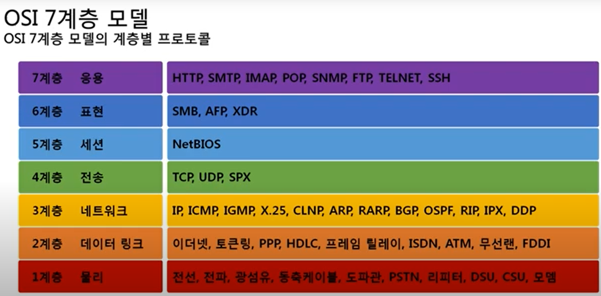

# [02_네트워크 모델](https://www.youtube.com/watch?v=Av9UFzl_wis&list=PL0d8NnikouEWcF1jJueLdjRIC4HsUlULi)

## TCP/IP 모델

#### 현재 인터넷에서 컴퓨터들이 서로 정보를 주고받는데 쓰이는 / 프로토콜 모음

- 4계층 : 응용

- 3계층 : 전송
- 2계층 : 네트워크
- 1계층 : 네트워크 인터페이스

- *c.f. 네트워크 패킷을 살펴보면 TCP/IP 모델에 잘 맞는다.*

## OSI 7계층 (모델)

#### 데이터를 주고받을 때 / 데이터 자체의 흐름을 / 각 구간별로 / 나누어 놓음 



### TCP/IP vs OSI 7 Layer 비교

- OSI 7 Layer 는 | 논리적으로 역할을 나눠놓음 | 통신 전반에 대한 표준
- TCP/IP model | 프로토콜 기반으로 분류, 기술 자체를 분류함 | 데이터 전송<u>기술 특화</u>

*c.f. `http` 도 5~7계층*

## 패킷(네트워크를 통해 전달됨)

### 패킷이란?

- **네트워크 상에서 전달되는 데이터를 통칭**
- <u>네트워크에서 전달하는 데이터의 형식화된</u> **블록**
- 구성 : 제어 정보 + 사용자 데이터(Payload) 
- idea : 여러 번 포장된 택배 상자 느낌

### 캡슐화

- <u>정의 : 여러 프로토콜을 이용해서 / 패킷을 만드는 과정</u>

- 상위계층에서 하위계층으로 내려가면서 / 프로토콜을 붙인다. (=패킷을 만든다.)
  (하위 프로토콜 앞에 상위 프로토콜이 올 수 없다.)

- HTTP 를 페이로드로 해서
- TCP 를 헤더로 붙임

- 다시 이 패킷을(TCP+HTTP) 페이로드로 해서 IPv4 를 헤더로 붙인다.
- 다시 이 패킷을(IPv4+(TCP+HTTP)) 페이로드로 해서 Ethernet 을 헤더로 붙인다. 

### 디캡슐화

- <u>정의 : 패킷을 받았을 때 / 프로토콜을 하나씩 확인하면서 / (마지막) 데이터를 확인하는 과정</u> 

### PDU(Protocol Data Unit)

- 각각의 계층에서 패킷(통칭)을 부르는 용어가 다르다.

- 4계층의 PDU : 세그먼트
- 3계층의 PDU : 패킷 (통칭과 다름)
- 2계층의 PDU : 프레임 (와이어샤크에서 확인)
  - 2계층까지 캡슐화된 상태

## 실습

- [todo] 와이어샤크 이용하여 패킷 캡처 => 프로토콜의 캡슐화된 모습 확인, 계층별 프로토콜 확인

- ```
  ping 8.8.8.8
  ```

  - Ethernet | IPv4 | ICMP

- 